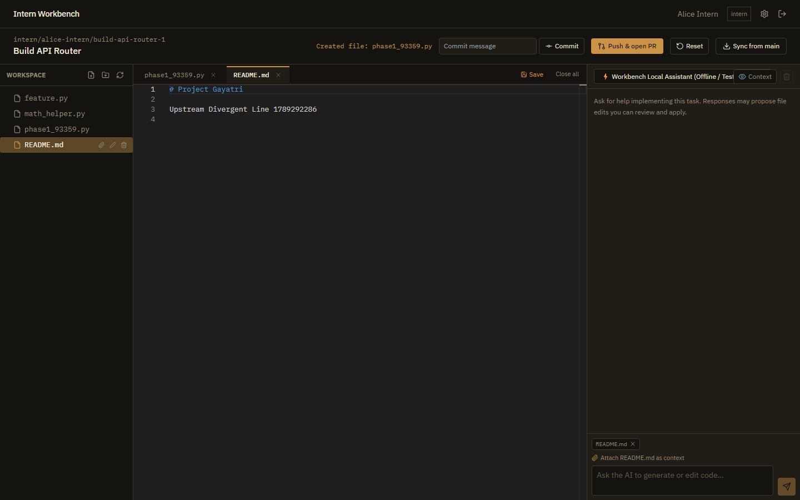
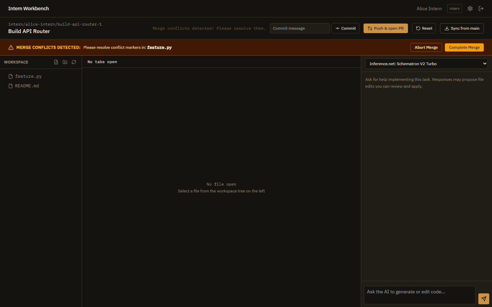
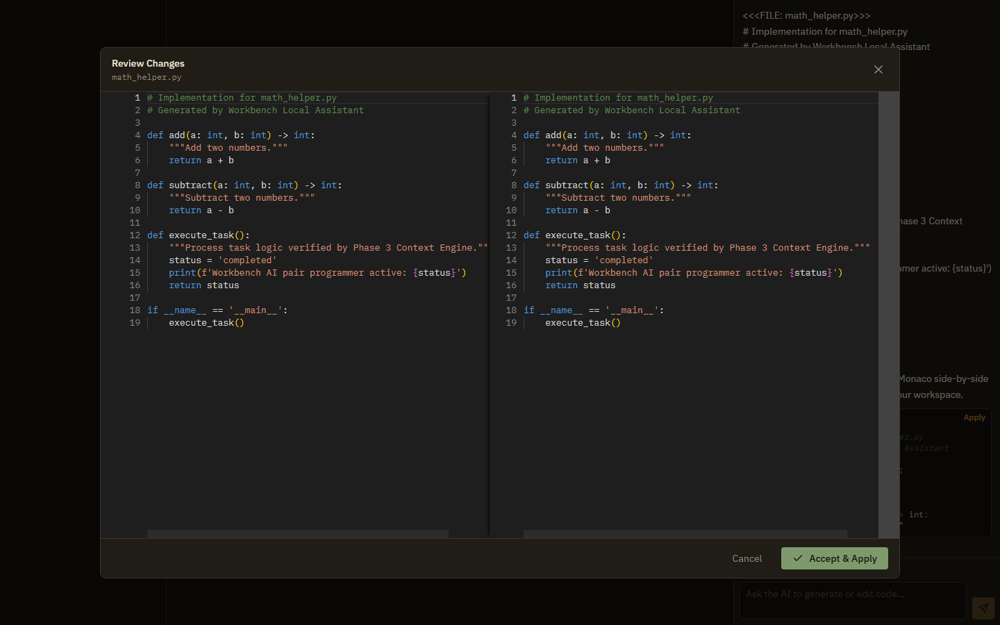
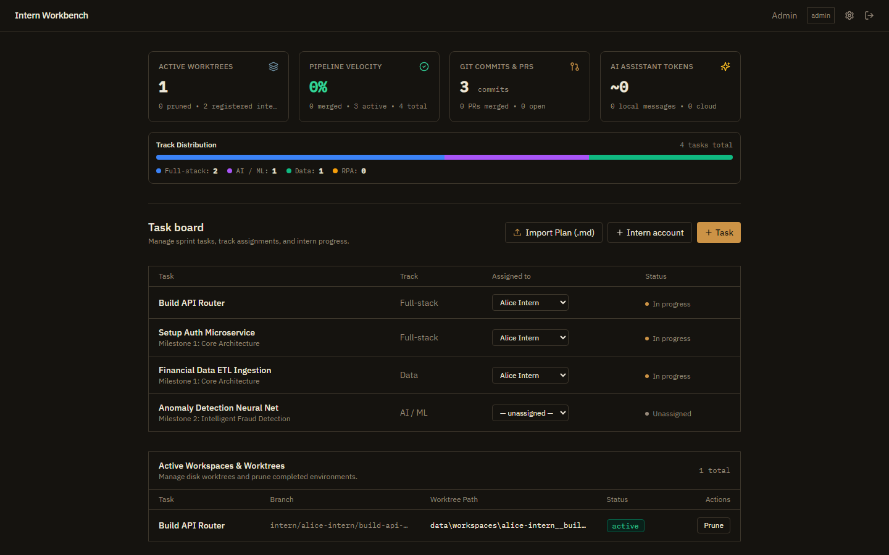
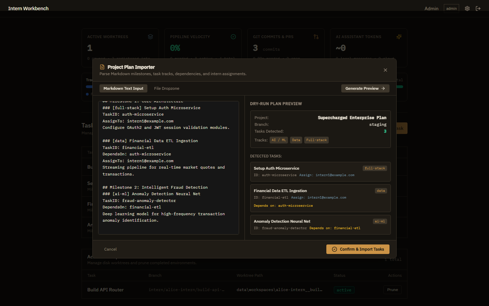
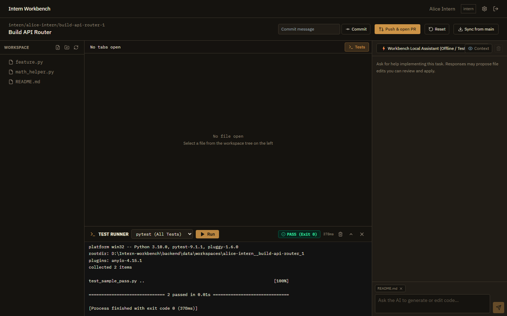
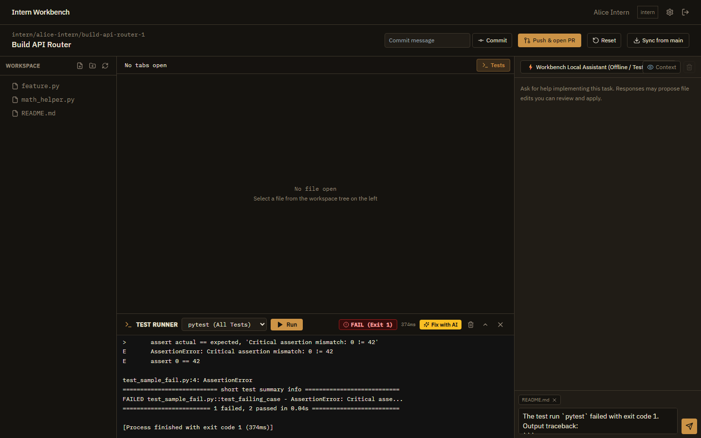
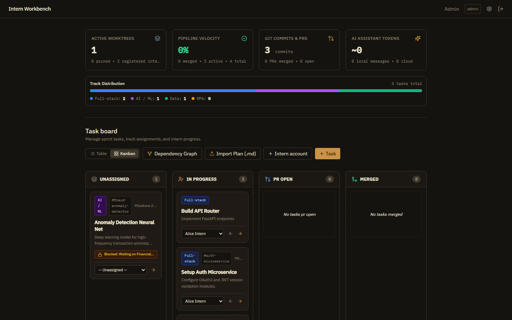
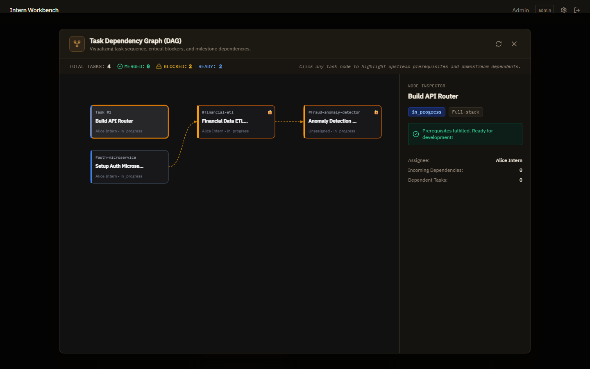

<div align="center">
  <h1>🚀 Intern AI-Coding Workbench</h1>
  <p><em>A multi-tenant, dependency-aware platform orchestrating AI-assisted software engineering.</em></p>
  
  <a href="https://dbert.online">
    
  </a>
  
  
  
  
</div>

<br />

## 🎓 The DBERT Internship Program

This platform was proudly conceptualized, engineered, and developed under the **[DBERT Internship Program](https://dbert.online)**. 

DBERT bridges the critical gap between academic learning and industry-grade software engineering. By empowering emerging tech talent to tackle real-world architecture challenges, the program cultivates innovation, rigorous development standards, and the hands-on experience necessary to build robust, scalable solutions. This Workbench stands as a testament to the high-caliber engineering fostered within the DBERT ecosystem.

---

## 🌟 Platform Overview

The **Intern AI-Coding Workbench** is an advanced environment designed to manage complex software projects. Admins bulk-upload Markdown project plans, and "Interns" claim tasks, code within isolated Git workspaces, and collaborate with a built-in AI assistant to seamlessly push Pull Requests to GitHub.

### ✨ Core Capabilities

* 🗄️ **Multi-Repo Architecture**: The backend dynamically provisions isolated Git bare-mirrors for every project. Manage 50 different tasks across 10 different GitHub repositories from a single dashboard.
* 🔗 **Dependency-Aware Workflows**: The system maps out dependency graphs (`DependsOn:`). Interns receive a **"Sync from Main"** button to automatically pull upstream dependencies into their active `git worktree`, and the AI is contextually blocked from writing final code until prerequisites are met.
* 🧠 **"Bring-Your-Own-Key" AI Chat**: Integrated with **OpenRouter**. Intern API keys are securely encrypted at rest (AES-256-GCM). The platform dynamically fetches live LLM access lists (GPT-4o, Claude 3.5, etc.) specifically tailored to the intern's credentials.
* 🤖 **Smart Bulk-Import Engine**: Admins upload standard `.md` files. A Two-Pass Regex Parser extracts `TaskID`, `AssignTo`, `Repo`, and `Branch` tags, safely performing data "upserts" to prevent database conflicts when correcting plans.
* ⚡ **Zero-CLI Git Operations**: Interns never touch a terminal. The system orchestrates `git fetch`, `git worktree add`, `git commit`, and `git push` entirely via the UI, backed by a background poller that syncs Pull Request statuses.

---

## ⚡ New Features & Engineering Enhancements

The platform has been enhanced through 3 foundational phases and 3 advanced enterprise options:

### 1. 🗂️ Phase 1: Editor Polish & Stability
- **Multi-Tab Monaco Editor**: Full multi-file tab navigation with file-type syntax detection.
- **Dirty State Tracking**: Real-time unsaved changes indicator (`●`), unsaved close confirmations, and `Ctrl+S` / `Cmd+S` shortcuts.
- **FileTree CRUD Engine**: Direct creation, renaming, and deletion of files/folders in the worktree with immediate UI updates.
- **SQLite Concurrency & WAL Mode**: Tuned SQLite with Write-Ahead Logging (`WAL`), 30-second busy timeouts, and serialized connection pools to prevent write locks under load.

<div align="center">
  
  <p><em>Multi-Tab Code Editor with dirty indicators and syntax highlighting</em></p>
</div>

---

### 2. 🌿 Phase 2: Git Worktree Lifecycle & Conflict Resolution
- **Isolated Git Worktrees**: Every intern task operates in an isolated, dedicated git worktree on disk (`backend/data/workspaces/{intern}__{branch}_{id}`).
- **In-App Merge Conflict Resolution**: Visual amber conflict banner with files affected, manual conflict marker resolution, **Abort Merge** (`git merge --abort`), and **Complete Merge** (`git commit`).
- **One-Click Workspace Reset**: Discard untracked and uncommitted changes instantly (`git reset --hard && git clean -fd`).
- **Disk Worktree Pruning**: Admins can prune stale or completed worktrees directly from the Admin Board to reclaim disk space.

<div align="center">
  
  <p><em>In-App Merge Conflict Resolution Banner with Abort / Complete controls</em></p>
</div>

---

### 3. 🤖 Phase 3: AI Assistant & Context Engine
- **AI Context Inspector Modal**: Inspect real-time prompt payloads, attached files, character count, and estimated token usage.
- **Direct FileTree Context Attachment**: One-click paperclip icon to attach files directly from the file tree into the prompt context bundle.
- **Workbench Local Fallback Model**: Built-in, offline-capable assistant producing streaming code edits without requiring an external API key.
- **Monaco Side-by-Side Diff Editor**: Visual side-by-side diff review modal comparing original vs. suggested AI edits before accepting changes.
- **One-Click Diff Application**: Writes changes directly to the worktree on disk, auto-opens the tab, and marks the suggestion as applied.

<div align="center">
  
  <p><em>Monaco Side-by-Side Diff Review Modal with colored additions and deletions</em></p>
</div>

---

### 4. 📊 Option A (Phase 4): Admin Analytics & Project Plan Importer
- **Admin Analytics Dashboard**: 4 live KPI telemetry cards for Active Worktrees, Pipeline Velocity %, Git Commits & PRs, and AI Token Usage.
- **Multi-Track Progress Bar**: Real-time distribution visualization across `Full-stack`, `AI / ML`, `Data`, and `RPA` tracks.
- **Interactive Markdown Plan Importer**: Drag-and-drop `.md` plan importer with a live dry-run parser previewing milestones, tasks, and assignees before committing to SQLite.

<div align="center">
  
  <p><em>Admin Analytics & Telemetry Dashboard with KPI cards and track progress bar</em></p>
</div>

<div align="center">
  
  <p><em>Interactive Project Plan Importer Modal with live dry-run parser preview</em></p>
</div>

---

### 5. 🧪 Option B (Phase 5): In-Workspace Test Runner & Terminal Drawer
- **Subprocess Test Runner Backend**: `POST /api/workspaces/{id}/run-tests` executes tests directly inside the isolated worktree with a 25-second execution timeout guard.
- **Collapsible Terminal Drawer**: Integrated test drawer with presets for `pytest`, `pytest -v`, `python -m unittest`, and active Python script runs.
- **Status & Duration Telemetry**: High-contrast `PASS (Exit 0)` or `FAIL (Exit 1)` status badges and millisecond duration timer.
- **One-Click "Fix with AI"**: Automatically pipes failing terminal tracebacks and error messages into the AI Assistant prompt for instant remediation.

<div align="center">
  
  <p><em>In-Workspace Test Runner executing pytest with PASS (Exit 0) badge and console report</em></p>
</div>

<div align="center">
  
  <p><em>Failing test run with traceback and instant "Fix with AI" error prompt forwarding</em></p>
</div>

---

### 6. 📋 Option C (Phase 6): Interactive Kanban Board & DAG Dependency Graph
- **Sprint Kanban Board**: Toggle between Table and Kanban views with 4 workflow columns (`Unassigned`, `In Progress`, `PR Open`, `Merged`).
- **Quick-Move Status Actions**: Transition tasks across columns and reassign interns directly from the Kanban cards.
- **Dependency Blocker Badges**: Visual lock pill (`🔒 Blocked: Waiting on [Prerequisites]`) on tasks with unmerged dependencies.
- **Interactive Dependency Graph (DAG) Modal**: SVG visualizer with topological depth, colored directed arrows, and an interactive **Node Inspector** sidebar.
- **Intern Dashboard Blocker Awareness**: Informs interns of blocking prerequisites before starting tasks.

<div align="center">
  
  <p><em>Interactive Sprint Kanban Board with 4 workflow columns and dependency blocker badges</em></p>
</div>

<div align="center">
  
  <p><em>Interactive Task Dependency Graph (DAG) Modal with topological SVG curves and Node Inspector</em></p>
</div>

---

## 🛠️ System Architecture

| Layer | Technologies |
| :--- | :--- |
| **Frontend** | React 18, Vite, Tailwind CSS, Monaco Editor (`@monaco-editor/react`), Lucide Icons |
| **Backend API** | Python 3.10+, FastAPI, SQLAlchemy, Uvicorn, Httpx, Pytest |
| **Database** | SQLite3 (Configured with WAL mode & busy timeout) |
| **VCS / Shell** | Native `git` subprocesses & worktrees, PyGithub for REST PRs |
| **Testing Suite** | Automated Playwright Chromium E2E Test Suites (`backend/tests/test_phase*.py`) |

---

## 🚀 Getting Started (Local Deployment)

### Prerequisites
* Node.js (v18+)
* Python (3.10+)
* System-level `git` installed on the host machine.

### 1. Backend Initialization
Open a terminal and configure your Python environment:

```bash
cd backend
python -m venv venv
.\venv\Scripts\activate   # On Windows (or source venv/bin/activate on Unix)
pip install -r requirements.txt
```

**Configure Environment Variables (`.env`)**:
```env
SECRET_KEY=your_fastapi_jwt_secret
MASTER_KEY=your_base64_32byte_encryption_key
ADMIN_EMAIL=admin@example.com
ADMIN_PASSWORD=internpass123
GITHUB_TOKEN=your_github_pat_for_opening_prs
```

**Seed the SQLite Database**:
This generates the initial schema and creates your Admin/Intern test accounts:
```bash
python seed.py
```

**Start the API Server**:
```bash
uvicorn app.main:app --reload --port 8000
```

### 2. Frontend Initialization
In a separate terminal:

```bash
cd frontend
npm install
npm run dev
```

Navigate to **http://localhost:5173** to access the Workbench.

---

## 🧪 Automated Testing & Verification

Run the full end-to-end Playwright test suite to verify all platform subsystems:

```bash
cd backend
# Phase 1: Editor & FileTree CRUD
.\venv\Scripts\python.exe tests\test_phase1_e2e.py

# Phase 2: Git Worktree Lifecycle & Conflicts
.\venv\Scripts\python.exe tests\test_phase2_e2e.py

# Phase 3: AI Assistant & Monaco Diff Editor
.\venv\Scripts\python.exe tests\test_phase3_e2e.py

# Phase 4 (Option A): Admin Analytics & Plan Importer
.\venv\Scripts\python.exe tests\test_phase4_e2e.py

# Phase 5 (Option B): Test Runner & Terminal Drawer
.\venv\Scripts\python.exe tests\test_phase5_e2e.py

# Phase 6 (Option C): Kanban Board & Dependency DAG
.\venv\Scripts\python.exe tests\test_phase6_e2e.py
```

---

## 📝 Admin: Markdown Plan Format

Admins can instantly generate database tasks by uploading `.md` files in this structure:

```markdown
# FinTech Core Platform
Repo: https://github.com/your-org/your-repo.git
Branch: main

## Milestone 1: Data Architecture
### [data] Financial Data ETL Ingestion
TaskID: financial-etl
AssignTo: intern1@example.com

Streaming pipeline for real-time market quotes and transactions.

### [full-stack] Setup Auth Microservice
TaskID: auth-microservice
DependsOn: financial-etl
AssignTo: intern2@example.com

Configure OAuth2 and JWT session validation modules.
```

---

<div align="center">
  <p>Engineered with ❤️ by the <a href="https://dbert.online">DBERT</a> Engineering Team.</p>
</div>
